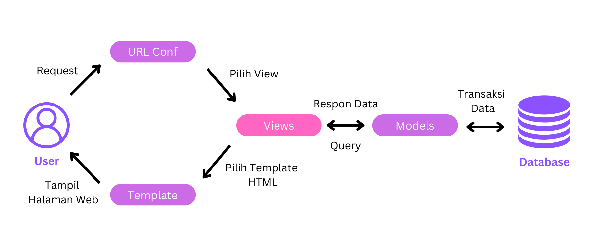

Link App Heroku: https://tugas-2-app.herokuapp.com/katalog/  
Link Repo: https://github.com/joselinprmt/repo-tugas-pbp
 

1. Buatlah bagan yang berisi request client ke web aplikasi berbasis Django beserta responnya dan jelaskan pada bagan   
tersebut kaitan antara urls.py, views.py, models.py, dan berkas html  

   *  Alur permintaan proses pada Django, pertama-tama akan diproses melewati urls, yang kemudian diteruskan ke views.  
   Views memiliki fungsi yang didefinisikan oleh developer untuk memproses permintaan. Jika terdapat proses yang  
   memerlukan pemanggilan database, views akan memanggil query ke models, yang kemudian database akan mengembalikan  
   hasil query tersebut ke views. Setelah permintaan selesai diproses, hasilnya akan dipetakan ke dalam HTML yang  
   sebelumnya sudah didefinisikan. Akhirnya, HTML akan dikembalikan ke pengguna sebagai respons.  
   

2. Jelaskan kenapa menggunakan virtual environment? Apakah kita tetap dapat membuat aplikasi web berbasis Django tanpa  
menggunakan virtual environment? 
   * Pada pengembangan suatu project, kita menggunakan virtual environment karena virtual environment dapat menyajikan  
   environment khusus developing yang independent dari sistem operasi host (perangkat yang sedang digunakan), sehingga  
   dengan mudah kita dapat memisahkan dependencies dari masing-masing project yang sedang dikembangkan.
   * Ya, kita dapat membuat aplikasi web berbasis Django di luar virtual environment, namun dependencies yang digunakan  
   akan berefek secara global pada host yang sedang digunakan.  
   

3. Jelaskan bagaimana cara kamu mengimplementasikan poin 1 sampai dengan 4 di atas.
   1.	Pada **views.py**, dilakukan inisialisasi fungsi show_katalog yang menerima parameter request dan akan mengembalikan  
   render(request, "katalog.html", context), dan mengimport CatalogItem dari models.py
   2.	Dilakukan routing dalam **url.py** dengan memetakan fungsi show_katalog dari views.py agar nantinya dapat menampilkan  
   HTML katalog pada browser. Routing dilakukan dengan menambahkan path show_katalog pada urlpatterns
   3.	Selanjutnya dilakukan mapping data barang pada **katalog.html** yang dirender sebelumnya pada views. Data akan ditampilkan dalam bentuk  
   table. Dimanfaatkan juga sintaks django, contohnya {{nama}}, {{npm}}, {{barang.item_name}}, dan lain-lain.
   4.	Setelah selesai, akan dilakukan **deployment** pada Heroku dari app katalog yang telah dibuat. Pada assignment kali  
   ini, katalog dapat ditampilkan pada https://tugas-2-app.herokuapp.com/katalog/
