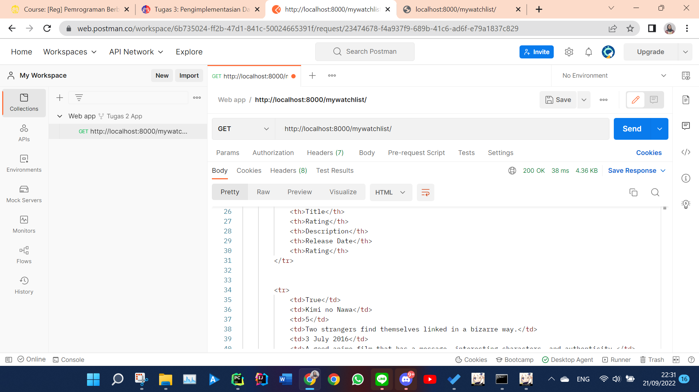
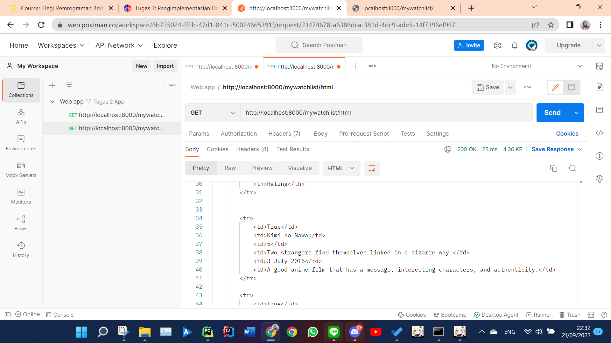
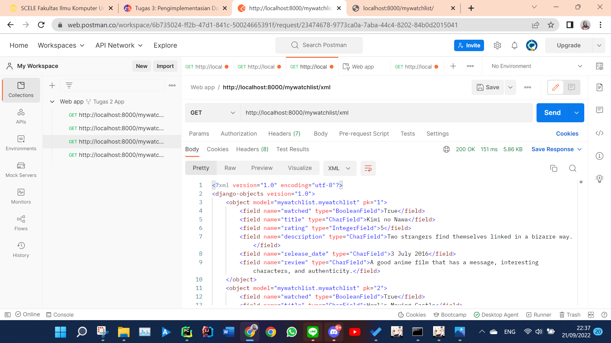
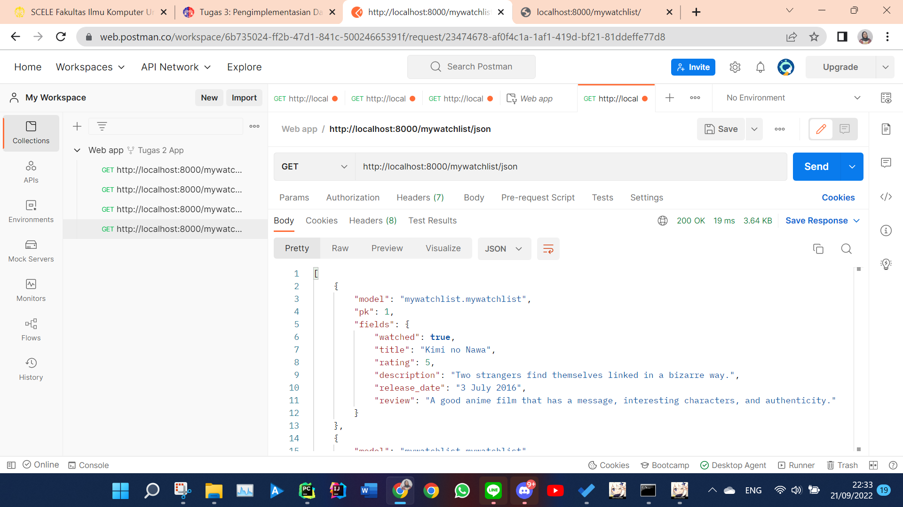

# Tugas 3: MyWatchList App

Link App Heroku: https://tugas-2-app.herokuapp.com/mywatchlist/  
Link Repo: https://github.com/joselinprmt/repo-tugas-pbp
 

1. Jelaskan perbedaan antara JSON, XML, dan HTML!
    * JSON atau JavaScript Object Notation adalah salah satu jenis data delivery yang diturunkan dari bahasa pemrograman 
    JavaScript, sehingga memudahkan jika kita ingin mengubah data ke dalam objek native JavaScript. Namun, kode untuk membaca 
    dan mengenerate JSON data bisa dilakukan di bahasa pemrograman lain. Data JSON disajikan dalam format pasangan name/value
    dan tanda kurung kurawal untuk menyatakan objek. JSON relatif lebih mudah digunakan daripada XML.
    * XML, Extensible Markup Language adalah salah satu jenis data delivery yang memanfaatkan struktur data Tree dalam
    dalam menyajikan datanya. Dalam merepresentasikan item data, digunakan struktur tag, dan relatif lebih sulit untuk
    digunakan.
    * HTML atau  HyperText Markup Language adalah bahasa markup standar untuk suatu dokumen yang didesain untuk ditampilkan 
    dalam web browser. HTML mendeskripsikan struktur dari web page yang selanjutnya dimanfaatkan sebagai tampilan dari 
    dokumen. Berbeda dengan XML dan JSON, HTML lebih berfokus pada tampilan dan fondasi dari web yang akan ditampilkan.  
   

2. Jelaskan mengapa kita memerlukan data delivery dalam pengimplementasian sebuah platform? 
    * Data delivery adalah salah satu tahap dalam pengembangan platform yang secara umum bertujuan sebagai wadah untuk 
    menyajikan data dan informasi. Adanya implementasi data delivery akan memudahkan user dalam melihat dan 
    merepresentasikan data yang perlu kita tampilkan, sehingga tahap ini penting dilakukan dalam pengembangan platform.
    

3. Jelaskan bagaimana cara kamu mengimplementasikan checklist di atas.
    * Diawali dengan membuat folder python package dengan nama **mywatchlist** pada repo tugas minggu lalu. Setelah itu, 
    menambahkan mywatchlist pada INSTALLED_APPS di settings.py pada folder project_django. Selanjutnya juga menambah path
    mywatchlist/ dan men*include* mywatchlist.urls pada urls.py di project_django.
    * Membuat models.py dan inisialisasi class MyWatchList dengan atribut: watched, title, rating, description, dll, serta
    menentukan field yang akan dipakai tiap-tiap atributnya.
    * Menambah folder fixtures yang di dalamnya berisi initial_film_data.json, dan menambahkan minimal 10 data di dalamnya.
    * Dibuat views.py yang memuat 3 fungsi, show_watchlist, show_xml, dan show_json. Fungsi-fungsi tersebut akan memanggil
    data delivery sesuai apa fungsi yang direquest oleh user. Pada folder templates, dibuat file mywatchlist.html dengan 
    context berupa list_film pada file json yang telah dibuat sebelumnya, beserta nama, dan npm. 
    * Selanjutnya, pada urls.py, dilakukan import terhadap fungsi-fungsi tersebut dari views. Selanjutnya dinisialisasikan 
    variabel app_name dengan value 'mywatchlist', dan dilakukan routing pada path '', 'html/', 'xml/', dan 'json/', sehingga
    setelah server di*run*, akan bisa dilakukan routing pada localhost:8000/mywatchlist/ dan akan ditampilkan data sesuai
    format data deliverynya.
    * Setelah berhasil di run pada server lokal, dilakukan push pada repo dan deployment pada app django pada link
    https://tugas-2-app.herokuapp.com/mywatchlist/

# Screenshoot Postman
  

Format HTML
  

Format XML
  

Format JSON
